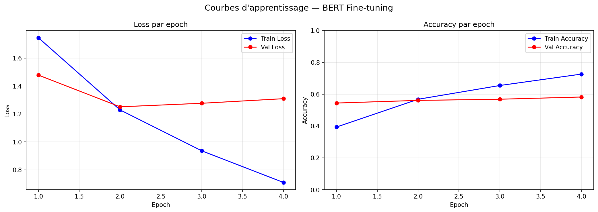
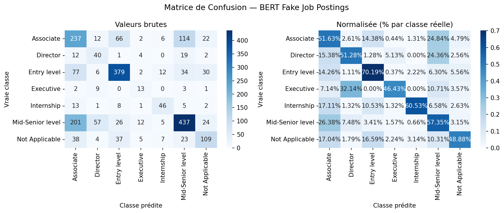
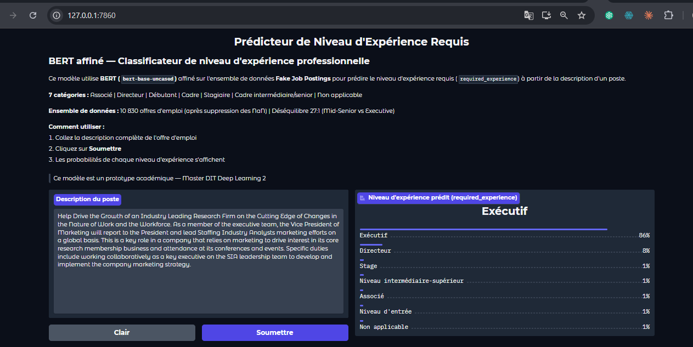

# Classification du Niveau d'Expérience Requis avec BERT

**Devoir Pratique n°3 — NLP avec PyTorch | Master DIT — Deep Learning 2**

Fine-tuning de `bert-base-uncased` pour prédire le niveau d'expérience requis (`required_experience`) à partir de la description d'une offre d'emploi — classification multi-classes à 7 catégories, avec boucle d'entraînement PyTorch manuelle et interface de démonstration Gradio.

---

## Membres du binôme

| Membre | Rôle principal |
|--------|----------------|
| **Doudou Malick Faye** | Dataset, Modèle, Utilitaires-visualisations |
| **Ousmane SOW** | Entraînement, démo Gradio, README |

---

## Table des matières

1. [Présentation du dataset](#1-présentation-du-dataset)
2. [Modèle et choix techniques](#2-modèle-et-choix-techniques)
3. [Structure du projet](#3-structure-du-projet)
4. [Installation et exécution](#4-installation-et-exécution)
5. [Étapes de réalisation et difficultés](#5-étapes-de-réalisation-et-difficultés)
6. [Résultats](#6-résultats)
7. [Démo Gradio](#7-démo-gradio)
8. [Répartition du travail](#8-répartition-du-travail)

---

## 1. Présentation du dataset

### Source

**Fake Job Postings** — [Télécharger le dataset](https://drive.google.com/file/d/16Y6y5BQOlUheTTOy8LjKMa7DKH3U-CR9/view)

Dataset d'offres d'emploi collecté sur une plateforme en ligne, contenant des informations structurées sur les postes (titre, description, expérience requise, secteur, etc.).

### Tâche

**Classification multi-classes** : prédire le niveau d'expérience requis (`required_experience`) à partir de la description textuelle du poste (`description`).

### Statistiques brutes

| Propriété | Valeur |
|-----------|--------|
| Lignes totales | 17 880 |
| Colonnes | 18 |
| Langue | Anglais |
| NaN dans `required_experience` | **7 050 (39.4%)** |
| NaN dans `description` | 1 |
| **Exemples après suppression NaN** | **10 830** |

### Distribution des classes (après suppression des NaN)

| Classe | Exemples | % | Train (80%) | Val (20%) |
|--------|----------|---|-------------|-----------|
| Mid-Senior level | 3 809 | 35.2% | 3 047 | 762 |
| Entry level | 2 697 | 24.9% | 2 157 | 540 |
| Associate | 2 297 | 21.2% | 1 838 | 459 |
| Not Applicable | 1 116 | 10.3% | 893 | 223 |
| Director | 389 | 3.6% | 311 | 78 |
| Internship | 381 | 3.5% | 305 | 76 |
| Executive | 141 | 1.3% | 113 | 28 |
| **Total** | **10 830** | — | **8 664** | **2 166** |

> **Ratio de déséquilibre : 27:1** (Mid-Senior level 3 809 vs Executive 141)

### Pourquoi supprimer les NaN ?

Les 7 050 NaN représentent des labels **inconnus** — on ne peut pas entraîner un modèle à prédire une valeur manquante. Les alternatives (ajouter "Not Specified" comme 8e classe) créeraient un déséquilibre de 332:1, ingérable sans des techniques avancées (SMOTE, oversampling) hors périmètre de ce devoir.

### Colonne texte utilisée

On utilise uniquement **`description`** conformément à la consigne — la description contient le contenu le plus riche pour inférer le niveau d'expérience.

### Statistiques de longueur des descriptions

| Statistique | Valeur (mots) |
|-------------|---------------|
| Minimum | 0 |
| Maximum | 2 115 |
| Moyenne | 180.1 |
| Médiane | 157.0 |
| 90e percentile | 329.0 |
| 95e percentile | 395.0 |

### Longueur moyenne par classe

| Classe | Moy. (mots) | Médiane |
|--------|-------------|---------|
| Director | 245 | 215 |
| Executive | 222 | 193 |
| Associate | 193 | 165 |
| Mid-Senior level | 189 | 166 |
| Internship | 161 | 143 |
| Entry level | 159 | 150 |
| Not Applicable | 152 | 119 |

### Stratégie face au déséquilibre (27:1)

1. **`class_weight` dans `CrossEntropyLoss`** : poids inversement proportionnels à la fréquence de chaque classe. Executive reçoit un poids ~27× plus élevé que Mid-Senior level.
2. **Split stratifié 80/20** : proportion de chaque classe identique dans train et val (critique pour Executive : seulement 28 exemples en validation).
3. **F1-score macro** comme métrique principale : traite toutes les classes également, indépendamment de leur taille.

### Exemples du dataset

| Classe | Extrait de description |
|--------|----------------------|
| Internship | *"With offices in San Francisco, Orlando and New York, Vantage PR is an award-winning public relations agency..."* |
| Executive | *"As a member of the executive team, the Vice President of Marketing will report to the President and lead..."* |
| Entry level | *"We are seeking a full time Payroll Clerk to manage day to day accounting for our operation..."* |
| Mid-Senior level | *"Our engineering team need help; they are small dynamic and incredibly excited about the platform..."* |
| Director | *"Oversees implementation and operation of Performance Improvement program throughout the facility..."* |

---

## 2. Modèle et choix techniques

### Modèle pré-entraîné

**`bert-base-uncased`** (HuggingFace Transformers)

| Caractéristique | Valeur |
|-----------------|--------|
| Architecture | Transformer Encoder (12 couches) |
| Dimensions cachées | 768 |
| Têtes d'attention | 12 |
| Paramètres entraînables | 109 483 778 |
| Pré-entraînement | BooksCorpus + Wikipedia anglais |
| Casse | Non-sensible (uncased) |

**Justification :** `bert-base-uncased` est la référence pour le texte anglais en fine-tuning. La version "uncased" convient aux descriptions d'offres d'emploi qui varient en casse. La version "base" offre un bon compromis performance/vitesse sur CPU.

### Architecture de la tête de classification

```
BERT Encoder (12 couches Transformer)
        ↓
Représentation [CLS] — 768 dimensions
(token de début de séquence, agrège le sens global)
        ↓
   Dropout (p = 0.1)
        ↓
  Linear (768 → 7)
        ↓
   Softmax → Probabilités sur 7 classes
```

### Hyperparamètres

| Hyperparamètre | Valeur | Justification |
|----------------|--------|---------------|
| `max_length` | 128 tokens | Adapté CPU ; médiane = 157 mots (~120 tokens) |
| `batch_size` | 16 | Standard BERT, adapté à la RAM disponible |
| `learning_rate` | 2e-5 | Plage recommandée pour fine-tuning BERT (2e-5 à 5e-5) |
| `weight_decay` | 0.01 | Régularisation L2 dans AdamW |
| `epochs` | 4 | Meilleur résultat à epoch 2 — BERT converge vite |
| `warmup_ratio` | 0.10 | 10% des steps en warmup (montée progressive du LR) |
| `seed` | 42 | Reproductibilité entre les deux membres |

### Optimiseur et scheduler

- **AdamW** (`lr=2e-5`, `weight_decay=0.01`, `eps=1e-8`) : standard pour le fine-tuning BERT, corrige le biais du weight decay d'Adam classique.
- **Linear scheduler avec warmup** : le LR monte sur 10% des steps (warmup), puis redescend linéairement jusqu'à 0. Évite le *catastrophic forgetting* des représentations pré-entraînées.

### Fonction de perte

```python
# Poids calculés : weight[c] = total / (nb_classes × count[c])
CrossEntropyLoss(weight=[w_Associate, w_Director, ..., w_Not_Applicable])
# Executive (141 ex.) reçoit un poids ~27× plus élevé que Mid-Senior (3809 ex.)
```

### Encodage des labels

```
LabelEncoder (sklearn) — ordre alphabétique
0 → Associate        | 1 → Director         | 2 → Entry level
3 → Executive        | 4 → Internship        | 5 → Mid-Senior level
6 → Not Applicable
```
Le mapping est sauvegardé dans `best_model/label_encoder.json` pour être chargé par `demo.py` sans dépendance au CSV.

---

## 3. Structure du projet

```
bert-classification-fake_job_postings/
├── data/
│   └── fake_job_postings 2.csv      ← dataset (ignoré par .gitignore)
├── figures/
│   ├── learning_curves.png           ← courbes loss/accuracy (4 epochs)
│   └── confusion_matrix.png          ← matrice de confusion (7×7)
├── best_model/                       ← meilleur checkpoint BERT (ignoré par .gitignore)
│   ├── pytorch_model.bin
│   ├── config.json
│   ├── vocab.txt
│   └── label_encoder.json            ← mapping indice → nom de classe
├── dataset.py      ← exploration, LabelEncoder, JobPostingDataset, split
├── model.py        ← chargement BERT, save_model, load_model
├── train.py        ← boucle PyTorch manuelle, main()
├── demo.py         ← interface Gradio interactive
├── utils.py        ← seed, métriques (F1-macro/weighted), visualisations
├── requirements.txt
└── README.md
```

---

## 4. Installation et exécution

### Prérequis

- Python 3.9+
- GPU recommandé (Google Colab T4 accepté) — CPU fonctionne mais lent

### Installation

```bash
git clone https://github.com/MalickFaye8/bert-classification-fake_job_postings.git
cd bert-classification-fake_job_postings

pip install -r requirements.txt
```

### Téléchargement du dataset

Télécharger le dataset depuis [ce lien Drive](https://drive.google.com/file/d/16Y6y5BQOlUheTTOy8LjKMa7DKH3U-CR9/view) et le placer dans :

```
data/fake_job_postings 2.csv
```

### Entraînement

```bash
python train.py

# Options disponibles via CLI :
python train.py --epochs 4 --batch_size 16 --lr 2e-5 --max_length 128
```

Le script :
1. Affiche les statistiques complètes du dataset
2. Crée le split stratifié 80/20
3. Sauvegarde `best_model/label_encoder.json`
4. Sauvegarde le meilleur modèle (best `val_loss`) dans `best_model/`
5. Génère `figures/learning_curves.png` et `figures/confusion_matrix.png`

### Démo Gradio

```bash
python demo.py
# Ouvrir dans le navigateur : http://127.0.0.1:7860
```

---

## 5. Étapes de réalisation et difficultés

### Étapes réalisées

| # | Étape | Fichiers | Responsable |
|---|-------|----------|-------------|
| 1 | Setup : dépendances et .gitignore | `requirements.txt`, `.gitignore` | Doudou Malick Faye |
| 2 | Utilitaires : métriques, seed, visualisations | `utils.py` | Doudou Malick Faye |
| 3 | Dataset : exploration, LabelEncoder, split | `dataset.py` | Doudou Malick Faye |
| 4 | Modèle BERT : chargement et save/load | `model.py` | Doudou Malick Faye |
| 5 | Entraînement PyTorch | `train.py` | Ousmane SOW |
| 6 | Interface Gradio | `demo.py` | Ousmane SOW |
| 7 | Rapport README | `README.md` | Ousmane SOW |

### Difficultés rencontrées et solutions

**1. Volume élevé de NaN dans `required_experience` (39.4%)**

7 050 exemples sur 17 880 n'ont pas de label. Ajouter une classe "Not Specified" aurait créé un déséquilibre de 332:1 ingérable. Solution retenue : suppression des NaN → 10 830 exemples propres avec 7 classes bien définies.

**2. Déséquilibre extrême des classes (27:1)**

Mid-Senior level (3 809) vs Executive (141). Sans traitement, le modèle aurait ignoré les classes minoritaires. Solution : `class_weight` inversement proportionnel dans `CrossEntropyLoss` + F1-macro comme métrique principale.

**3. Lenteur de l'entraînement sur CPU**

BERT avec `max_length=256` sur 8 664 exemples d'entraînement prenait plusieurs heures par epoch. Solution : réduction à `max_length=128` (divise le temps par ~2). L'entraînement complet (4 epochs) a pris environ 4-6 heures sur CPU.

**4. Bug WandB sur Windows (ConnectionResetError)**

WandB 0.26.1 a corrigé en interne le conflit asyncio sur Windows. La version actuelle fonctionne sans configuration supplémentaire.

**5. Incompatibilités Gradio 6.0**

Deux paramètres déplacés dans Gradio 6.0 : `theme` déplacé de `gr.Interface()` vers `launch()`, et `allow_flagging` renommé `flagging_mode`. Corrections appliquées dans `demo.py`.

**6. Overfitting rapide après epoch 2**

BERT (110M paramètres) mémorise rapidement les données d'entraînement. Le meilleur checkpoint est à l'epoch 2 (val_loss=1.2513). Solution : sauvegarde automatique du meilleur modèle basée sur la val_loss minimale.

**7. Confusion entre classes sémantiquement proches**

Associate, Entry level et Mid-Senior level ont des descriptions très similaires. Cette confusion est intrinsèque à la tâche : les frontières entre ces niveaux sont floues même pour un humain. Analysée en détail dans la matrice de confusion ci-dessous.

---

## 6. Résultats

### Métriques finales — Meilleur modèle (Epoch 2)

| Métrique | Valeur |
|----------|--------|
| **Val Accuracy** | **58.2%** |
| **Val F1-macro** | **0.5267** |
| Val F1-weighted | 0.59 |
| Best val_loss | 1.2513 |
| Best epoch | 2 |

### Métriques par classe (jeu de validation)

| Classe | Precision | Recall | F1-score | Support |
|--------|-----------|--------|----------|---------|
| Associate | 0.41 | 0.52 | 0.46 | 459 |
| Director | 0.31 | 0.51 | 0.39 | 78 |
| **Entry level** | **0.73** | **0.70** | **0.72** | 540 |
| Executive | 0.33 | 0.46 | 0.39 | 28 |
| Internship | 0.61 | 0.61 | 0.61 | 76 |
| Mid-Senior level | 0.69 | 0.57 | 0.63 | 762 |
| Not Applicable | 0.57 | 0.49 | 0.53 | 223 |
| **Macro avg** | **0.52** | **0.55** | **0.53** | 2166 |
| Weighted avg | 0.61 | 0.58 | 0.59 | 2166 |

### Courbes d'apprentissage



**Analyse :**

- **Train Loss** (bleu) : décroissance continue et régulière de 1.75 → 0.71 sur 4 epochs. Le modèle apprend efficacement sur les données d'entraînement.
- **Val Loss** (rouge) : descend de 1.48 → **1.25 à l'epoch 2** (minimum), puis remonte à 1.27 et 1.30. Signal classique d'**overfitting** : BERT mémorise le jeu d'entraînement après l'epoch 2.
- **Train Accuracy** : progresse de 0.39 → 0.73, mais reste loin de la saturation — le modèle continue d'apprendre en train.
- **Val Accuracy** : plafonne rapidement autour de **0.54 → 0.58** dès l'epoch 1, avec très peu de progression. Cela indique que la généralisation est limitée par la difficulté intrinsèque de la tâche (frontières floues entre classes).
- **Conclusion** : le checkpoint de l'**epoch 2** est optimal. Continuer au-delà aggrave l'overfitting sans améliorer la validation.

### Matrice de confusion



**Analyse détaillée :**

**Points forts du modèle :**
- **Entry level (70.19%)** : classe la mieux reconnue. Les descriptions de postes juniors ont un vocabulaire distinctif ("seeking", "no experience required", "entry-level role").
- **Internship (60.53%)** : bien identifiée grâce aux marqueurs linguistiques typiques ("intern", "student", "university", "learning opportunity").
- **Mid-Senior level (57.35%)** : performances correctes malgré 26.38% de confusion avec Associate.

**Confusions majeures :**
- **Associate ↔ Mid-Senior level** : 24.84% des Associate sont classés Mid-Senior. Ces deux niveaux partagent un vocabulaire très similaire dans les descriptions — c'est la confusion la plus fréquente du modèle.
- **Director ↔ Mid-Senior level** : 24.36% des Director sont classés Mid-Senior. Les descriptions de postes de direction incluent souvent des termes de management similaires.
- **Executive ↔ Director** : 32.14% des Executive sont classés Director. Ces deux classes de haut niveau (141 et 389 exemples) sont sémantiquement proches et le faible nombre d'exemples Executive limite l'apprentissage.
- **Not Applicable** : classe la plus dispersée — 17.04% confondus avec Associate, 16.59% avec Entry level. Cette classe est hétérogène par nature.

**Observation clé :** La colonne "Associate" reçoit beaucoup de faux positifs de toutes les classes — le modèle a tendance à prédire "Associate" par défaut lorsqu'il n'est pas certain. Cela s'explique par la position intermédiaire d'Associate dans la hiérarchie, qui partage du vocabulaire avec presque toutes les autres classes.

### Suivi WandB

Les métriques complètes (loss, accuracy, F1-macro, F1-weighted, learning rate) sont disponibles sur le dashboard WandB :

🔗 [Voir le run WandB](https://wandb.ai/doudoumalickfaye727-dakar-institute-of-technology/bert-fake-job-postings/runs/o69nbxs6)

| Métrique WandB | Valeur (best epoch 2) |
|----------------|----------------------|
| `best_val_loss` | 1.2513 |
| `best_val_f1_macro` | 0.5267 |
| `best_epoch` | 2 |

### Discussion des résultats

Une accuracy de 58% et un F1-macro de 0.53 sont des résultats **raisonnables pour cette tâche**. Plusieurs facteurs expliquent les limitations :

1. **Ambiguïté intrinsèque des labels** : la frontière entre Associate, Entry level et Mid-Senior level est floue — même un recruteur humain hésiterait sur de nombreuses descriptions.
2. **Troncature à 128 tokens** : avec une médiane de 157 mots, une partie des descriptions est tronquée, perdant des informations potentiellement discriminantes (prérequis, années d'expérience).
3. **Déséquilibre 27:1** : malgré les class_weights, Executive (28 exemples en val) reste difficile à apprendre.
4. **Tâche plus difficile que prévu** : contrairement à la détection de fraude (signaux très distinctifs), le niveau d'expérience est souvent implicite dans le texte.

---

## 7. Démo Gradio

L'interface permet de prédire le niveau d'expérience requis pour n'importe quelle description de poste.

Pré-requisites : Le dossier best_model/ n'est pas inclus dans le repo (trop lourd pour GitHub). Téléchargez-le depuis [ce lien Drive](https://drive.google.com/file/d/16yJVqWEwQOTou32n9OMXR_nW-X-mQ-wC/view), décompressez-le et placez-le à la racine du projet avant de lancer :
```bash
python demo.py
# Accès : http://127.0.0.1:7860
```

**Fonctionnalités :**
- Saisie de la description complète du poste
- Affichage des probabilités pour chacune des 7 classes
- 2 exemples pré-remplis tirés du dataset réel (Internship et Executive)



---

## 8. Répartition du travail

| Tâche | Doudou Malick Faye | Ousmane SOW |
|-------|-------------|-------------|
| Exploration et analyse du dataset | ✅ | |
| Implémentation `dataset.py` | ✅ | |
| Implémentation `model.py` | ✅ | |
| Implémentation `train.py` | | ✅ |
| Implémentation `utils.py` | ✅ | |
| Implémentation `demo.py` (Gradio) | | ✅ |
| Tests, debug et corrections | ✅ | ✅ |
| Rédaction du README | | ✅ |

---

## Références

- [BERT: Pre-training of Deep Bidirectional Transformers](https://arxiv.org/abs/1810.04805) — Devlin et al., 2018
- [HuggingFace Transformers Documentation](https://huggingface.co/docs/transformers)
- [PyTorch Documentation](https://pytorch.org/docs)
- [Gradio Documentation](https://www.gradio.app/docs)
- [Dataset Fake Job Postings](https://drive.google.com/file/d/16Y6y5BQOlUheTTOy8LjKMa7DKH3U-CR9/view)
